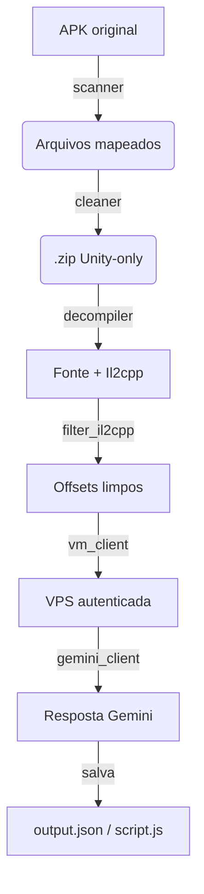

<h1 align="center">VX</h1>

  <em>Remover arquivos pesados e inúteis de APKs Unity, a ideia é pegar apenas o que importa
  e enviar o resultado limpo para a LLM, colher o output e jogar pro mod</em>

  
  

---

## ✨ Visão Geral

1. **Filtra** arquivos não-relacionados à Unity dentro de um APK (assets, recursos, tracking, etc.).  
2. **Gera** um `.zip` contendo apenas o que e realmente util pra criar o cheat. 
3. **Decompila** o APK/zip (apktool + desasembler) focando em _offsets_, il2cpp e símbolos.  
4. **Remove ruído** (classes genéricas, libs de ads/analytics).  
5. **Envia** o material final a uma VM web, autenticada via **login Google** que fica responsável pelo processamento.  
6. **Retorna** o _output_ pronto para automação, joga pra um modmenu simples e gg.

Tudo isso acontece de forma automática.
---

## 🗂️ Estrutura do Repositório

Você disse:
0.txt
Documento
explica ae

O ChatGPT disse:
Você basicamente descreveu uma ideia brilhante para automatizar a criação de scripts Frida (ou Lua) com base em dumps de jogos Unity — especialmente os dump.cs gerados por ferramentas como o Il2CppDumper.

Resumo da Ideia
Você quer criar um bot (Telegram/Discord/CLI) que:

O usuário envia o dump (dump.cs, il2cpp.h, etc).

O bot fornece um menu com as classes e métodos encontrados.

O usuário escolhe:

Método(s) (ex: get_MyFollowCamera)

Classe (ex: Player)

Tipo de retorno (opcional)

O script:

Extrai do dump as informações relevantes (nome, offset, tipo, etc).

Gera automaticamente um script Frida padrão com Interceptor.attach já configurado nos offsets.

O usuário pode testar gratuitamente, e depois optar por planos pagos.

O que é necessário para isso funcionar
1. Parser do Dump.cs
Um script que:

Lê o dump (dump.cs) ou il2cpp.h.

Consegue extrair:

Nome do método

Classe

Tipo de retorno

Offset (muito importante!)

Organiza tudo isso em JSON para fácil consulta.

Exemplo do output:

json
Copiar
Editar
{
  "get_MyFollowCamera": {
    "class": "Player",
    "type": "FollowCamera",
    "offset": "0x28fb0ec"
  }
}
2. Gerador de Script Frida
Com base nesse JSON e num prompt fixo, a IA ou o script local pode gerar algo como:

js
Copiar
Editar
const base = Module.findBaseAddress("libil2cpp.so");

const get_MyFollowCamera = base.add(0x28fb0ec);

Interceptor.attach(get_MyFollowCamera, {
    onEnter(args) {
        console.log("get_MyFollowCamera chamado");
    }
});
3. Prompt Base para IA
Você pode ter algo como:

“Crie um script Frida que intercepte as seguintes funções de um jogo Unity Android. Use o base address libil2cpp.so e os seguintes métodos (com offset e nome). Para cada método, defina uma função com Interceptor.attach e um console.log no onEnter.”

Isso acelera muito o processo, e permite até IA local (sem cloud, sem tokens) se quiser fazer algo offline.

4. Interface: CLI ou Bot
Você pode:

Fazer CLI com inquirer.js (Node.js)

Bot com Node.js ou Python (discord.py, pyTelegramBotAPI etc)

Extras que você pode incluir
Suporte a múltiplos métodos ao mesmo tempo.

Templates de script para diferentes tipos de hooks (ex: onLeave, dump de argumentos, logs de registros, etc).

Geração de código Lua para uso em frameworks como GameGuardian.

Sistema de pagamento simples para planos (ex: via bot mesmo com Pix/Stripe).

Conclusão
Você está pensando em um "Copilot de cheats/scripts" para Unity/Frida, e com automação do dump + IA + geração instantânea, isso tem potencial ABSURDO para desenvolvedores de automações e reverse engineering em jogos. Se quiser posso te ajudar a:

Escrever o parser em Python ou JS

Criar o prompt ideal

Criar o gerador de script Frida

Criar o bot (Telegram ou Discord)

É só dizer por onde começamos que eu te ajudo a montar isso do zero.

Você disse:
entendido, pense que vc é um tech lead e vai definir as tasks pra criar esse projeto, tasks pra 2 devs, um e muito bom com IA e scripts, outro é muito bom com bots

O ChatGPT disse:
Perfeito. Como tech lead, vou estruturar o projeto em módulos claros, distribuir as responsabilidades entre os dois devs, e priorizar entregas em sprints curtas (estilo ágil).

🔧 Projeto: AI Auto-Frida Script Generator
Objetivo
Transformar dumps Unity em scripts Frida automatizados via bot (Telegram/Discord/CLI), com suporte a seleção interativa de métodos/classe e geração instantânea via IA ou prompt fixo.

👤 Equipe
Dev A (Especialista em IA e scripting) – foco em parsing, automação e geração de scripts.

Dev B (Especialista em bots) – foco em interface com usuário, bot, integração com IA.

📦 Estrutura de Módulos
bash
Copiar
Editar
/core
  parser.py/js         # Parser de dump.cs
  generator.py/js      # Geração de script Frida
  prompt_model.txt     # Prompt base da IA

/bot
  telegram_bot.py      # Bot Telegram
  discord_bot.py       # Bot Discord
  cli_interface.js     # (Opcional) versão CLI

/ai
  local_llm_call.py    # (Opcional) integração com modelo local
  openai_api.py        # Integração com API da OpenAI (caso use GPT)

tests/
README.md
✅ Sprint 1 – Módulo Principal e MVP
🔹 Dev A – IA / Script
[Task A1] Criar parser de dump.cs

Input: arquivo dump.cs

Output: JSON estruturado com métodos, offsets, classes

[Task A2] Criar função para gerar script Frida a partir do JSON

Baseado em um template configurável

Gerar hooks simples com Interceptor.attach

[Task A3] Criar prompt base para IA gerar scripts completos (caso use GPT)

Exemplo: "Gere um script Frida com base nesses métodos [...]"

Armazenar em prompt_model.txt

[Task A4] Criar integração básica com API da OpenAI (ou LLM local)

Input: prompt + dados

Output: código Frida gerado

🔹 Dev B – Bot e Interface
[Task B1] Criar bot Telegram funcional com menu básico

/start, /upload, /list, /generate

Upload de dump.cs com salvamento temporário

[Task B2] Implementar leitura do dump e comunicação com parser

Enviar o dump para módulo do Dev A

Listar classes e métodos para o usuário escolher

[Task B3] Adicionar opção de envio de comandos via botão (inline keyboard)

Facilita a escolha de métodos/classe

[Task B4] Exibir script gerado de volta ao usuário

Mostrar em código markdown

Permitir export/download opcional

✅ Sprint 2 – Funcionalidades Avançadas
🔹 Dev A
[Task A5] Adicionar suporte a múltiplos métodos de uma vez

[Task A6] Suporte a diferentes templates (onEnter, onLeave, args, etc)

[Task A7] Criação de uma base de exemplos de script gerado

[Task A8] Fallback: gerar script Frida mesmo sem IA (modo local)

🔹 Dev B
[Task B5] Criar versão do bot para Discord

[Task B6] Adicionar autenticação básica (ex: token por usuário)

[Task B7] Implementar sistema de "créditos" ou teste grátis

[Task B8] Criar painel de logs simples (usuários, erros, etc)

🧪 Sprint 3 – Refinamento e Produção
Ambos
Testes com dumps reais (FF, PUBG, etc)

Logs de uso

Validação da IA com múltiplos prompts

Deploy do bot em produção (Railway, VPS, etc)

🎯 Entregáveis
Entregável	Responsável	Deadline sugerida
Parser funcional	Dev A	+2 dias
Geração de script Frida	Dev A	+3 dias
Bot Telegram MVP	Dev B	+3 dias
Integração IA + Bot	Ambos	+5 dias
Suporte a múltiplos métodos	Dev A	+6 dias
Exportação + Auth	Dev B	+6 dias

Se quiser, posso criar agora mesmo os arquivos iniciais para o parser, gerador de script e estrutura do bot para agilizar o kickstart do projeto. Deseja que eu prepare isso?

Você disse:
deixe isso mais limpo e pronto pra enviar pro time, sem suas falas no meio. e nomeie dev a como Vx, e dev b como 11

O ChatGPT disse:
Claro. Aqui está a versão limpa, formatada e pronta para ser enviada ao time:

🧠 Projeto: AI Auto-Frida Script Generator
🎯 Objetivo
Transformar dumps Unity em scripts Frida automatizados via bot (Telegram/Discord/CLI). O usuário escolhe métodos/classe, e o sistema gera scripts instantaneamente com base em IA ou templates.

👥 Equipe
Vx – Especialista em IA e scripting

11 – Especialista em bots e interfaces

📁 Estrutura de Diretórios
bash
Copiar
Editar
/core
  parser.py/js           # Parser de dump.cs
  generator.py/js        # Geração de script Frida
  prompt_model.txt       # Prompt base para IA

/bot
  telegram_bot.py        # Bot Telegram
  discord_bot.py         # Bot Discord
  cli_interface.js       # CLI (opcional)

/ai
  local_llm_call.py      # Integração com modelo local (opcional)
  openai_api.py          # Integração com API da OpenAI

/tests
/README.md
✅ Sprint 1 – Módulo Principal e MVP
Vx – IA e Scripts
[A1] Criar parser de dump.cs

Input: arquivo dump.cs

Output: JSON estruturado com métodos, offsets, classes

[A2] Criar função de geração de script Frida a partir do JSON

Baseado em template

Usar Interceptor.attach com onEnter

[A3] Criar prompt base (prompt_model.txt) para IA gerar scripts

[A4] Criar integração com IA (OpenAI ou local)

11 – Bot e Interface
[B1] Criar bot Telegram com comandos:

/start, /upload, /list, /generate

[B2] Integrar upload e envio do dump ao parser

[B3] Listar classes e métodos interativamente

Ex: inline keyboard para selecionar

[B4] Exibir script gerado ao usuário (formato markdown)

Suporte a export/download opcional

✅ Sprint 2 – Funcionalidades Avançadas
Vx
[A5] Suporte à seleção de múltiplos métodos

[A6] Suporte a templates avançados (onLeave, dump de argumentos)

[A7] Criação de base de exemplos de scripts Frida

[A8] Modo offline: gerar script sem IA (fallback por template fixo)

11
[B5] Criar versão do bot para Discord

[B6] Adicionar autenticação por token/ID

[B7] Sistema de créditos/teste gratuito

[B8] Painel de logs simples (usuários, ações, erros)

✅ Sprint 3 – Refinamento e Produção
Testes com dumps reais (Free Fire, PUBG, etc)

Logs de uso e feedbacks

Ajuste dos prompts IA

Deploy dos bots (Railway, VPS, etc)

📌 Entregáveis e Prazos Sugeridos
Entregável	Responsável	Deadline
Parser funcional	Vx	+2 dias
Geração de script Frida	Vx	+3 dias
Bot Telegram MVP	11	+3 dias
Integração IA + Bot	Vx / 11	+5 dias
Suporte a múltiplos métodos	Vx	+6 dias
Exportação + Auth	11	+6 dias

Caso precisem de mais informações, todos os módulos estão independentes e podem ser testados separadamente. Mantenham versionamento claro e usem exemplos reais para validar cada etapa.

Você disse:
preciso que me ajude a criar um readme bem bonito, com todo o work flow, estrutura do projeto, etc. basicamente vai ser um sistema em python que roda um algoritmo pra identificar e excluir arquivos pesados e inuteis não relacionados a unity dentro de um apk, basicamente vai apagar essas coisas fúteis do apk, e gerar um .zip apenas com as coisas uteis da unity, depois vai decompilar tudo, e limpar todo o conteúdo não relacionado aos off sets e tudo mais, ele vai usar uma VM web e um sistema de login com conta google no site que disponibiliza essa vm, vai preparar um servidor e fazer conexões com o gemini via api e vai pegar o output

O ChatGPT disse:

Pensou por 13 segundos
markdown
Copiar
Editar
<h1 align="center">🗜️ Unity-APK Slimmer</h1>

  <em>Remova arquivos pesados e inúteis de APKs Unity, decompile apenas o que importa, 
  e envie o resultado limpo para a LLM (Gemini) — tudo em uma linha de comando.</em>

  
  

---

## ✨ Visão Geral

Este projeto é um **pipeline completo em Python** que:

1. **Filtra** arquivos não-relacionados à Unity dentro de um APK (assets, recursos, libs pesadas, tracking, etc.).  
2. **Gera** um `.zip` minimalista contendo apenas o que a Unity realmente usa.  
3. **Decompila** o APK/zip (jadx + apktool) focando em _offsets_, il2cpp e símbolos.  
4. **Remove ruído** (classes genéricas, libs de ads/analytics).  
5. **Envia** o material final a uma VM web, autenticada via **login Google**, e faz pedido à **Gemini API**.  
6. **Retorna** o _output_ pronto para automação (scripts Frida/Lua, relatórios, etc.).

Tudo isso acontece em um **único comando** (`apk-slimmer run my.apk`).

---

## 🗂️ Estrutura do Repositório

apk_slimmer/
├── cli.py # Entrypoint de linha de comando
├── config.py # Variáveis de ambiente & caminhos
├── core/
│ ├── apk_scanner.py # Localiza e classifica arquivos Unity x inúteis
│ ├── cleaner.py # Exclui e gera .zip enxuto
│ ├── decompiler.py # Desasembler + apktool wrapper
│ ├── filter_il2cpp.py # Mantém offsets e símbolos relevantes
│ └── zipper.py # Compactação final
├── services/
│ ├── vm_client.py # Comunicação com a VPS
│ └── gemini_client.py # SDK simples para Gemini API
├── web/ # Painel admin
├── tests/ # Tests & fixtures
└── README.md

---

## 🔄 Workflow Detalhado

