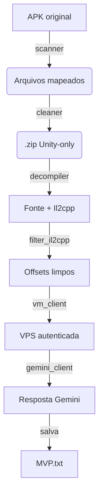

<h1 align="center">Vx7 🐍</h1>
<p align="center">
  <em>A ideia é remover arquivos pesados e inúteis de APKs Unity, pegar apenas o que importa, 
  e enviar o resultado limpo para a LLM.</em>
</p>

<p align="center">
  <a href="LICENSE"></a>
  
</p>

---

## ✨ Visão Geral

1. **Filtra** arquivos não-relacionados à Unity dentro do APK (assets, recursos, imagens, etc.).  
2. **Gera** um `.zip` contendo apenas o que o cheat vai usar. 
3. **Decompila** o APK/zip (desasembler + apktool) focando em _offsets_, il2cpp e símbolos.  
4. **Remove ruído** (classes genéricas, libs de ads/analytics, qualquer coisa nao relacionada).  
5. **Processa** o material final em uma VPS IDX autenticada via **login Google**, faz pedido ao **Gemini API**, roda o algoritmo etc.  
6. **Retorna** o _output_ pronto para jogar pro mod.

Tudo isso vai ser automático.

---

## 🗂️ Estrutura do Repositório

```
AI/

├── cli.py # Entrypoint de linha de comando

├── config.py # Variáveis de ambiente & caminhos

├── core/

│ ├── apk_scanner.py # Localiza e classifica arquivos Unity x inúteis

│ ├── cleaner.py # Exclui e gera .zip enxuto

│ ├── decompiler.py # Desasembler + apktool wrapper

│ ├── filter_il2cpp.py # Mantém offsets e símbolos relevantes

│ └── zipper.py # Compactação final

├── services/

│ ├── vm_client.py # Comunicação com a VPS

│ └── gemini_client.py # SDK simples para Gemini API

├── web/ # (Opcional) mini-painel Flask/FastAPI

├── tests/ # Pytest & fixtures

└── README.md ```
---

## 🔄 Workflowzinho



